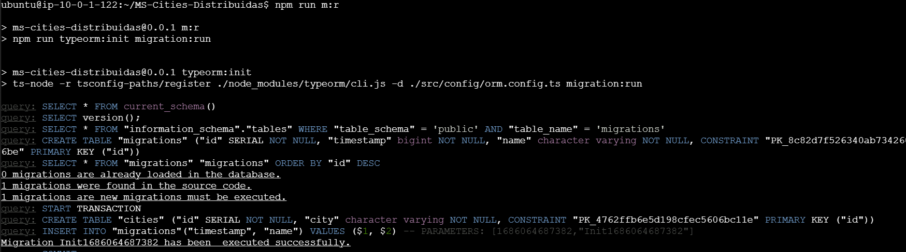

  

# 🚀 Terraform + AWS + GitHub Actions CI/CD

This project automates the deployment of **AWS infrastructure** using **Terraform** and **GitHub Actions**. The architecture includes:
- **VPC with public and private subnets**
- **EC2 Instance for Compute**
- **RDS PostgreSQL (Private Subnet)**
- **Terraform remote state stored in S3 & DynamoDB**
- **GitHub Actions for automated deployments**

---

## 🏗 **Infrastructure Overview**
The infrastructure is built using **Terraform modules**:

| Component      | Technology  | Description |
|---------------|------------|-------------|
| **Compute**   | AWS EC2     | Backend server running on **Ubuntu 20.04** |
| **Database**  | AWS RDS     | PostgreSQL 16 database in a **private subnet** |
| **Network**   | AWS VPC     | Custom VPC with **public & private subnets, security groups, and routing** |
| **State**     | AWS S3 + DynamoDB | Remote state storage for Terraform |
| **CI/CD**     | GitHub Actions | Automates infrastructure deployment on every **push to `main`** |

---

## 🛠 **Functional backend**
The REST API is a simple backend to use and test the Terraform & AWS infrastructure in which runs a migration to automate the DB

And exposes the POST & GET /cities endpoint to add a city and get all of them

